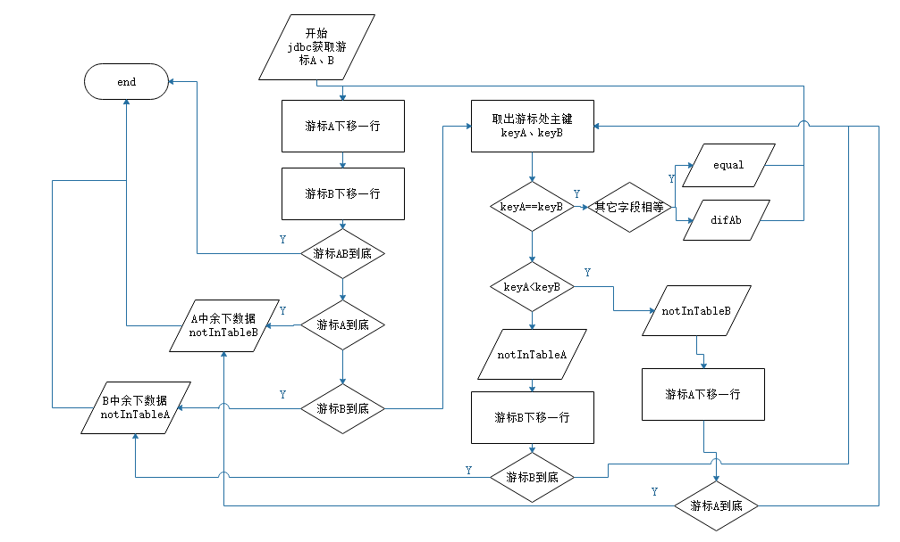

# tabledif
从两张结构一致的表中，对比出数据差异的小玩意

有时候，我们需要从两张结构相同的表(可能跨库，甚至数据库类型都不一样)中找到他们的差异数据，以进行增量更新、差异统计等操作。

那么，这个小玩意或许可以给你一些参考。

它有如下好处

· 可以跨库，甚至跨不同类型的数据库进行比对

· 可以比对出两张表中彼此缺失、增加、属性不同的数据

· 使用游标逐条取数据，不用把所有数据都拉内存中再比较，所以需求的内存资源非常小

但它也有如下限制

· 必须有唯一标识字段来

· 比对前，程序会按两张表的唯一标识字段进行排序查询，这会消耗比较多的时间，但可以通过加索引来降低耗时

· 两张表的结构必须完全一致，当然，如果不一致可以考虑利用视图等手段来适配

· 为了防止内存爆炸，需要setFetchSize，各类数据库的setFetchSize操作略有差异，本项目以postgresql为例且未做适配，你需要自己修改成你用的数据库

## 说明

原理很简单，先把两个表做个排序查询，然后移动游标尝试找到相同的唯一标识，由于唯一标识经过排序，所以可以简单的做一些判断就能判断数据差异,
流程图如下:

定义了如下几种状态，你可以编写实现类去处理遇到某种状态时进行什么操作

|  状态   | 说明  |
|  ----  | ----  |
| notInTableA  | B中有但A中没有 |
| notInTableB  | A中有但B中没有 |
| difAb  | AB都有，但值不一样 |
| equal  | 相同 |

使用示例参见 [这个demo](src/test/java/org/wowtools/tabledif/TableDifFinderTest.java)
